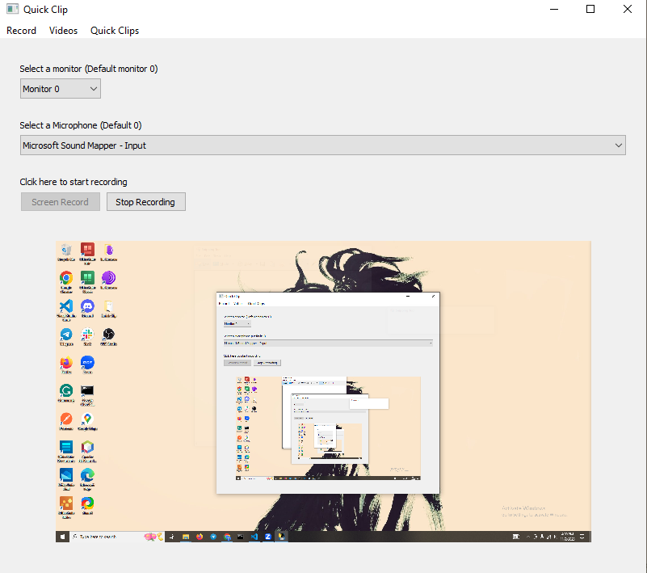

# Quick Clip

Quick Clip is a user-friendly screen recording application that's designed to be helpful for teaching assistants like me. It has a unique feature where it can automatically detect moments in your recording when there is no speech. Afterward, it can fast forward through these silent sections. This means that when you record a lecture or presentation, Quick Clip will help you skip over the silent parts automatically, making your videos more efficient and enjoyable for your audience.

## Heres a small demo of Quick Clip in action

## The Journey to Quick Clip

During the Spring semester, as the courses shifted to a more hybrid model, I realized that my students needed access to clearer and more engaging instructional content. The existing tools were somewhat clunky and didn’t cater to the specific needs of an educational setup. That's when I decided to take matters into my own hands.

I dove into the world of PyQt5, driven by the desire to create a tool tailored for educators like myself. Quick Clip is the culmination of this journey—a tool designed to not just capture the screen, but to transform the way we interact with recorded content. It’s smart; it recognizes the moments of silence and instead of cutting them out, it artfully fast-forwards through them, ensuring that the viewer's time is respected and the flow of content remains uninterrupted.

## Features

- **Intuitive Screen Recording**: Capture your entire screen or specific regions with ease and precision.
- **Smart Silence Detection**: Quick Clip intelligently detects periods of silence and ensures they are fast-forwarded during playback, maintaining the natural flow of the video.
- **Efficient Playback Experience**: Save time and maintain engagement with seamless playback, free from unnecessary pauses.
- **User-Friendly Interface**: Designed with the user in mind, ensuring a straightforward and hassle-free recording experience.
- **Tailored for Education**: Created by an educator, for educators and anyone in need of an efficient screen recording tool.

## Getting Started

Embark on a seamless screen recording journey with Quick Clip by following these simple steps:

### Prerequisites

Ensure Python is installed on your system. Download and install it from [the official Python website](https://www.python.org/downloads/) if you haven't already.

### Installation

1. **Clone the Repository**:  
   `git clone https://github.com/shuaib128/Quick-Clip.git`

2. **Navigate to the Project Directory**:  
   `cd Quick-Clip`

3. **Install the Required Modules**:  
   Run `pip install -r requirements.txt` to ensure all dependencies are set up.

### Usage

1. **Run the Application**:  
   Start Quick Clip by executing `python app.py` in the root directory.

2. **Start Your Recording**:  
   Dive into an intuitive interface to begin capturing your screen content.

3. **Enjoy Smart Playback**:  
   Replay your recordings, now enhanced with intelligent fast-forwarding through silent moments.

## Support and Contribution

Encounter any bumps along the way or have suggestions to make? Feel free to [open an issue](https://github.com/shuaib128/Quick-Clip/issues) or contribute to the project. Your feedback and contributions are highly valued.

---

Embark on a smoother screen recording journey with Quick Clip, where every second counts and your content remains king.
